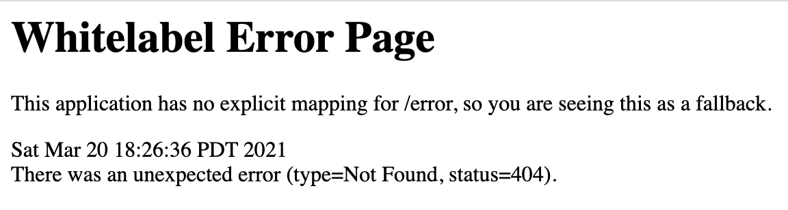

# How to Plan and Build a Project

This article describes the process I have been using for several years to plan how to build any project whether it is a smaller personal project or a large project with a team of developers. This is also similar to the process we use on our team at work.

To get started, we create three very short and simple artifacts before starting to building a new project. A one-pager, a workflow diagram, and a task list. Depending on the size of the project, this usually takes one person a day or less to complete.

These artifacts are created in this order. First, a one-page description of the project in human terms. Anyone should be able to read this single page and know what the project will do. Next, a workflow diagram is created which is actually a combination sequence, class, and workflow diagram. Once the workflow diagram is done, a task list is created from the workflow diagram with tasks broken down into single day units of work. The task list tells us where to start and what else we will be doing each day until the project is done.

The following describes these three artifacts using a small project as an example.

## How to Write a One-Pager

A one-pager is typically a single page or less that describes the project in human terms so anyone reading it will know what the project will do. I usually just start describing the project, usually starting with the problem that needs to be solved and what I want it to do.

For a personal project, I am the one who writes the one-pager. At work, the one-pager is typically written by the product owner.

## Sample one-pager

# Landing Page Service

We have some courses and other digital products we would like to create landing pages for that will collect the email addresses of people interested in each of these products.

We would like to collect the email addresses somewhere so we can send out emails to inform our prospective customers about the products they are interested in. It would be nice if the system would automatically send a response email thanking the prospective customer for registering. That would give the customer an immediate response rather than waiting for us to notice that a new customer registered and then sending them an email manually much later.

Since we will have several digital products the emails sent to the customer should be tailored to the product they are interested in. That way, we can customize the email sent out for a particular product.

It would be nice to have the ability to create an email template for a product that way we can personalize the email with their name or other information about the product.

We have seen other email marketing systems that can send out a series of emails spaced out with a couple of days in between. We would like to be able to schedule a series of emails for a product and specify the number of days in between each email and the next one.

Some of the emails may have links to PDFs or other downloadable links.

Once a customer purchases a product, they should no longer receive sales related emails and they should now be sent product related update emails.

We would like to track where an email addresses was submitted from so we can see which marketing campaigns were successful and which ones were not and at what point the customer converted. There could be several locations with the email input form and it is possible we will add this to blog articles or other places.

A customer should be able to unsubscribe from receiving emails. If customer registers again after unsubscribing we would like that email address to be reactivated from where they left off.

## How to Create a Workflow Diagram

Next, we create a workflow diagram from the one-pager description. This workflow diagram is a combination of a sequence diagram and a class diagram done in a workflow like form. This diagram does not use strict UML, just boxes and lines with arrows or diamonds, and a bunch on text in the whitespace to describe that part of the diagram. I often number the steps or show some form of entry point so the reader knows where to start from. The boxes are classes or screen mockups, the lines with arrows indicate the direction of flow while the lines with diamonds indicate class relationships.

## Sample workflow diagram


To create this diagram, I am using Balsamiq Mockups but you can use anything that can draw boxes and lines. I used to use paper and pencil. Balsamiq has that browser widget you see on the left but it could just as well be a box that said browser in the middle of it.

I started drawing this diagram from the one-pager by going through it looking for things that have information we need. Looking at the one-pager, I picked the word "product" from the first paragraph and figured it should have a name and description. Reading through the next few paragraphs, I picked out the word "email" and drew that box. Don't start connecting lines yet, just put the boxes on the diagram on the first pass. From there I put all of the other boxes on the diagram then started grouping the boxes that should be next to each other. After that, I drew the lines and put some of the text from the one-pager on the diagram reworded to describe the program flow.

With the diagram completed, it is easier to review the system to see milestone boundaries for releases. In the diagram, we were able to trim out an MVP by simply having the receiving handler send out a response email instead of having to develop the automated part of the system to get an initial release of something functional.

Once the task breakdown step is completed (below) the tasks identified are added to the workflow diagram to show what part of the system that task builds.

## How to Create a Task Breakdown

With the workflow diagram completed, I start from the entry point and create a task list to complete that one box or line on the diagram. This could be a single task if it can be completed in a day; otherwise, it ends up being a description of what needs to be accomplished and a list of subtasks are created in single day chunks until the parent task is completely tasked out. Then it is on to the next box or line in the work flow. Sometimes, there are multiple entry points so each of those are addressed in the same manner.

In the diagram above, the entry point for the MVP starts with the web page form at step 4.

Task durations can be whatever you or your team are comfortable with. For myself, I like one day tasks because it is a day of work or less. I often have gaps in time that I am working on a personal project, so having the task done is better than trying to remember where I was a few days ago. With a team, you have pull requests to be reviewed then testing, so a single day of development will typically run about 3 days with 24-hour turnaround. One for development, one for review and any changes, one for testing.

This sample task breakdown has all of the system tasked out to give a complete example. Normally, I would only task the part that is going to be built in the current release. In this case, the MVP in blue on the diagram would be the only part tasked out or tasks 1 through 9 below.

With the task list, I know where to start and what I will be doing one task after the other until the project is done.

## Sample task breakdown

# Landing Page Service

## Allow customers to register with their email (post request to database, send email)

## Publish landing page

* Task 1: Get an application server running locally with template landing page
* Task 2: Get template landing page hosted on the Internet
* Task 3: Modify the landing page to customize it for our business
* Task 4: Modify the landing page to send a post request to a url with a fake campaign\_id and the entered email address

## Save email addresses

* Task 5: Create an email endpoint to receive the email post request
* Task 6: Create a database table to save email addresses
* Task 7: Save the email address received to the email database table

## Send email response

* Task 8: Modify the email endpoint to send a thank you response email
* Task 9: Modify the landing page to popup a thank you message

## This is now a functional MVP!

## Process emails (restful processing, database)

## Administrative pages (add authentication)

* Task 10: Create an administrative website for restricted access
* Task 11: Add authentication to the website for administrative pages
* Task 12: Add an administrative user account

## Get the list of email addresses (get request to return a list)

* Task 13: Add an endpoint that returns the list of emails
* Task 14: Add a web page that displays the list of emails

## Add products (post request to create records in the database)

* Task 15: Create a web page to post a product
* Task 16: Create a product endpoint to receive the product post request
* Task 17: Create a database table to save products
* Task 18: Save the product received to the product database table

## Add campaigns (containment database relationships)

* Task 19: Create a web page to post a campaign
* Task 20: Create a campaign endpoint to receive the campaign post request
* Task 21: Create a database table to save campaigns
* Task 22: Save the campaign received to the campaign database table

## Associate emails to products by campaign (aggregate database relationships)

* Task 23: Modify the email endpoint to look up the campaign
* Task 24: Create a database table to save the product-email associations
* Task 25: Modify the email endpoint to create the product-email association
* Task 26: Modify the email listing to show the products an email is interested in

## Email templates (using templates)

* Task 27: Create an email template to use for sending the thank you response email
* Task 28: Modify the thank you response email to use the template
* Task 29: Create a web page to post an email template
* Task 30: Create an endpoint to receive an email template
* Task 31: Create a database table to save the email template
* Task 32: Save the email template received to the email template database table
* Task 33: Use the email template to send the thank you response email

## Scheduling tasks (restful, database, sending emails)

## Schedule email (more restful)

* Task 34: Create an endpoint to receive a scheduled email
* Task 35: Create a database table to save the scheduled email
* Task 36: Create a web page to post a scheduled email
* Task 37: Save the scheduled email to the scheduled email database table

## Send scheduled emails (running scheduled tasks)

* Task 38: Create a scheduled process that sends scheduled emails
* Task 39: Fetch scheduled emails to send
* Task 40: Send emails

## Campaign flow (scheduling the next task)

* Task 41: Modify the scheduled process to schedule the next email template as a scheduled email

# How to setup a Java development environment

1. Check for Java 11

    Open a terminal window and run this command:

    ```
    $ java -version
    ```

    You should see something like this:

    ```
    $ java -version

    openjdk version "11.0.10" 2021-01-19
    OpenJDK Runtime Environment AdoptOpenJDK (build 11.0.10+9)
    OpenJDK 64-Bit Server VM AdoptOpenJDK (build 11.0.10+9, mixed mode)    
    ```

    If Java 11 is already installed, skip to the `Install Java` step

1. Install Java

    1. Open your browser and open https://adoptopenjdk.net/

    1. Choose version: `OpenJDK 11 (LTS)`

    1. Choose JVM: `HotSpot`

    1. Download the latest release

    1. Open the downloaded package and follow the prompts to install Java 11

1. Install Maven

    1. Open your browser and open https://maven.apache.org/download.cgi

    1. Scroll down to `Files`

    1. Click the link for your operating system

        Windows: `apache-maven-*-bin.zip`

        Linux: `apache-maven-*-bin.tar.gz`

        Mac: `apache-maven-*-bin.tar.gz`

    1. Extract the downloaded archive in the directory of your choice

    1. Add the maven directory to your `PATH` variable

        For Mac, open a terminal window and run the following commands:

        Extract the archive to `/usr/local/share`:

        ```
        $ sudo tar zxvf ~/Downloads/apache-maven-3.6.3-bin.tar.gz --directory /usr/local/share

        ```

        Create a symbolic link in `/usr/local/bin`:

        ```
        $ sudo ln -s /usr/local/share/apache-maven-3.6.3/bin/mvn /usr/local/bin/mvn
        ```

        Verify the maven version installed:

        ```
        $ mvn -v

        Apache Maven 3.6.3 (cecedd343002696d0abb50b32b541b8a6ba2883f)
        Maven home: /usr/local/share/apache-maven-3.6.3
        Java version: 11.0.10, vendor: AdoptOpenJDK, runtime: /Library/Java/JavaVirtualMachines/adoptopenjdk-11.jdk/Contents/Home
        Default locale: en_US, platform encoding: UTF-8
        OS name: "mac os x", version: "10.15.6", arch: "x86_64", family: "mac"        
        ```

1. Initialize a Java application server with Spring Boot

    1. Open your browser and open https://start.spring.io/
    
    1. Choose project: `Maven`
    
    1. Choose language: `Java`

    1. Keep the selected Spring Boot version
    
    1. Configure project metadata:
    
        1. Group is your reverse domain name (the default is fine for now)
            
            `example: com.example`

        1. Artifact is the name of this application with no spaces (the default is fine for now)
            
            `example: my-application`

        1. Name is the human readable name of this application with spaces (the default is fine for now)

            `example: My Application`

        1. Description is the description for this application

            `example: My first Java web application`

        1. Package name is reverse domain plus the name of the application

            `example: com.example.myapplication`

    1. Choose packaging: `Jar`

    1. Choose Java: `11`

    1. Click the `Add Dependencies` button

    1. Search for `Web`

    1. Add `Spring Web`

    1. Click the `Generate` button to download the application

    1. In the directory of your choice, extract the downloaded application

    1. Open a terminal window in the directory where you extracted the downloaded application

    1. Run the following command to build and run your application:

        ```
        $ mvn springboot:run
        ```

    1. Open your web browser and open http://localhost:8080

    1. You should see an error page like this:

        

        This means our application is running but we have not adding anything to it yet.
